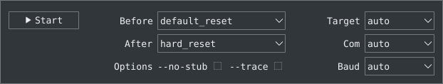
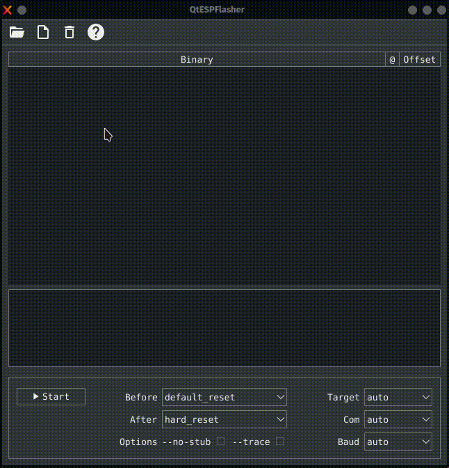
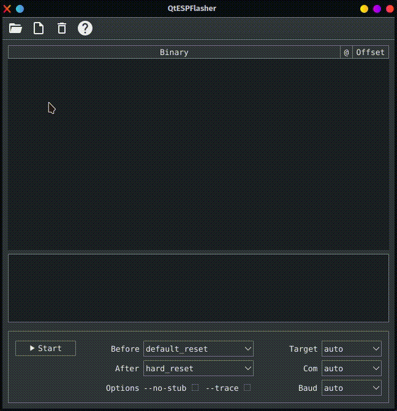
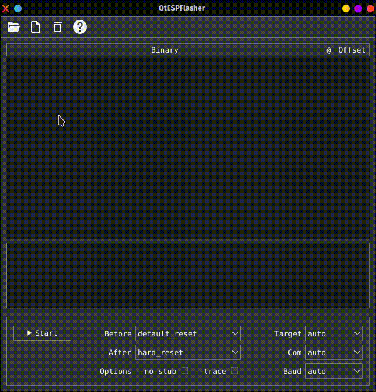

[](https://github.com/higaski/QtESPFlasher/actions/workflows/build.yml) [](https://github.com/higaski/QtESPFlasher/raw/master/LICENSE)

QtESPFlasher is CLI/GUI wrapper around [esp-serial-flasher](https://github.com/espressif/esp-serial-flasher), a portable C library for flashing of [Espressif](https://www.espressif.com/) SoCs.

It currently supports the following ESP microcontrollers:
- [ESP8266](https://www.espressif.com/en/products/socs/esp8266)
- [ESP32](https://www.espressif.com/en/products/socs/esp32)
- [ESP32S2](https://www.espressif.com/en/products/socs/esp32-s2)
- [ESP32C3](https://www.espressif.com/en/products/socs/esp32-c3)
- [ESP32S3](https://www.espressif.com/en/products/socs/esp32-s3)
- [ESP32C2](https://www.espressif.com/en/products/socs/esp32-c2)
- [ESP32H2](https://www.espressif.com/en/products/socs/esp32-h2)
- [ESP32C6](https://www.espressif.com/en/products/socs/esp32-c6)

<details>
  <summary>Table of contents</summary>
  <ol>
    <li><a href="#features">Features</a></li>
    <li><a href="#options">Options</a></li>
      <ul>
        <li><a href="#reset-modes">Reset modes</a></li>
        <li><a href="#disabling-the-stub-loader">Disabling the stub loader</a></li>
        <li><a href="#trace">Trace</a></li>
        <li><a href="#chip-type">Chip type</a></li>
        <li><a href="#serial-port">Serial port</a></li>
        <li><a href="#baud-rate">Baud rate</a></li>
      </ul>
    <li><a href="#usage">Usage</a></li>
      <ul>
        <li><a href="#cli">CLI</a></li>
        <li><a href="#gui">GUI</a></li>
      </ul>
  </ol>
</details>

## Features
- **No dependencies**
- GUI flashes either
  - an [ESP-IDF](https://github.com/espressif/esp-idf) build directory
  - a [flasher_args.json](https://github.com/espressif/esp-idf/blob/master/components/esptool_py/flasher_args.json.in) file
  - a .zip archive
  - single/multiple loose binaries
- CLI is a drop-in replace for [esptools write-flash](https://docs.espressif.com/projects/esptool/en/latest/esp32/esptool/basic-commands.html#write-binary-data-to-flash-write-flash) command
- Pre-built Windows and Linux executables

## Options
Most options are supported equally by CLI and GUI. The following table contains all CLI options.
| Option          | Description                                                     |
| --------------- | --------------------------------------------------------------- |
| `-c`, `--chip`  | Target chip type                                                |
| `-p`, `--port`  | Serial port device                                              |
| `-b`, `--baud`  | Serial port baud rate                                           |
| `--before`      | What to do before connecting to the chip                        |
| `-a`, `--after` | What to do after QtESPFlasher is finished                       |
| `--no-stub`     | Disable launching the flasher stub, only talk to ROM bootloader |
| `-t`, `--trace` | Enable trace-level output of QtESPFlasher interactions          |
| `-l`, `--list`  | List all available serial devices                               |

And this screenshot shows how the options are displayed in the GUI.  


### Reset modes
By default, QtESPFlasher tries to hard reset the chip into bootloader mode before it starts and hard resets the chip to run the normal program once it is complete. The `--before` and `--after` options allow this behavior to be changed.

#### Reset before operation
The `--before` argument allows you to specify whether the chip needs resetting into bootloader mode before QtESPFlasher talks to it.
- `--before default_reset` is the default, which uses DTR & RTS serial control lines to try to reset the chip into bootloader mode.
- `--before no_reset` will skip DTR/RTS control signal assignments and just start sending a serial synchronization command to the chip. This is useful if your chip doesn't have DTR/RTS, or for some serial interfaces (like Arduino board onboard serial) which behave differently when DTR/RTS are toggled.

#### Reset after operation
The `--after` argument allows you to specify whether the chip should be reset after the QtESPFlasher operation completes.
- `--after hard_reset` is the default. The DTR serial control line is used to reset the chip into a normal boot sequence.
- `--after no_reset` leaves the chip in the serial bootloader, no reset is performed.

### Disabling the stub loader
The `--no-stub` option disables uploading of a software "stub loader" that manages flash operations, and only talks directly to the loader in ROM.

### Trace
QtESPFlasher has a `--trace` option which can be supplied in the first group of arguments (before the command). This will dump all traffic sent and received via the serial port to a log file called `trace.txt` in the application root directory.

### Chip type
The target chip type can be selected using the `-c`, `--chip` option. If no `-c` option is specified, QtESPFlasher automatically detects the chip type when connecting.

### Serial port
The serial port is selected using the `-p`, `--port` option. If no `-p` option is specified, QtESPFlasher will enumerate all connected serial ports and try each one until it finds an Espressif device connected.

### Baud rate
The default QtESPFlasher baud rate is 115200. Slower rates may be set using `-b`, `--baud`. It is **recommend** to only set the baud rate if you're experiencing transmission errors during flashing. If left at default QtESPFlasher tries to change the baud rate to 460800 when running to considerably reduce flash times.

## Usage
### CLI
When used as a command line tool QtESPFlasher can be a drop-in replace for the [esptools write-flash](https://docs.espressif.com/projects/esptool/en/latest/esp32/esptool/basic-commands.html#write-binary-data-to-flash-write-flash) command.

```sh
./QtESPFlasher -p ttyUSB0 write_flash 0x0 bootloader/bootloader.bin 0x10000 hello_world.bin
Connecting to ttyUSB0
Found esp32s3
Changing baud rate to 460800
Flash will be erased from 0x0 to 0x5fff
Writing at 0x400... (4%)
Writing at 0xc00... (14%)
Writing at 0x1400... (23%)
Writing at 0x1c00... (33%)
Writing at 0x2400... (42%)
Writing at 0x2c00... (52%)
Writing at 0x3400... (61%)
Writing at 0x3c00... (71%)
Writing at 0x4400... (80%)
Writing at 0x4c00... (90%)
Flash will be erased from 0x10000 to 0x4afff
Writing at 0x10400... (0%)
Writing at 0x16000... (10%)
Writing at 0x1bc00... (20%)
Writing at 0x21800... (30%)
Writing at 0x27400... (40%)
Writing at 0x2d400... (50%)
Writing at 0x33000... (60%)
Writing at 0x38c00... (70%)
Writing at 0x3e800... (80%)
Writing at 0x44800... (90%)
Writing at 0x4a130... (100%)
Hard resetting via RTS pin...
Done
```

### GUI
QtESPFlasher offers a few different ways to select binaries for flashing.

#### Add directory
The build directory of an ESP-IDF project can be selected directly using the  symbol. ESP-IDF builds generate a file called flasher_args.json which contains project flash information in JSON format. This file is red by QtESPFlasher to obtain all of the projects binaries and their offsets.  


#### Add .zip archive
A zipped ESP-IDF build directory can also be selected directly using the  symbol. The .zip file must contain a flasher_args.json file, just like when adding a directory.  


#### Add binaries
If there is no flasher_args.json file available, binaries can also be added directly. This is done by selecting .bin files with the  symbol. Please note that in this case the offset must be entered **manually**. Offsets in the C language convention, such as “0x” for base 16 or “0b” for base 2, are supported.  
